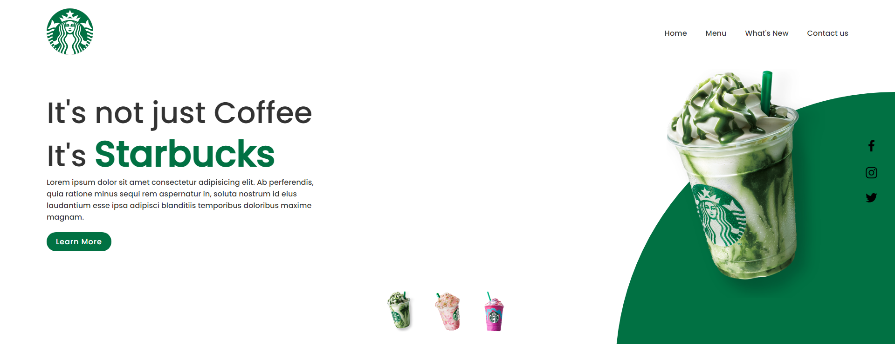

<h1 align="center"> Clone Landing Page Starbucks </h1>

    

Mini-projeto de clone de layout da página principal do [Starbucks](https://www.starbucks.com.br/) para estudo de utilização do CSS.

## Descrição

O site foi baseado na Starbucks é uma empresa multinacional norte-americana, com a maior cadeia de cafeterias do mundo. Tem sua sede na cidade de Seattle, estado de Washington. Contem animações para manter a atenção dos usuários e os links das redes sociais deles localizados do lado direito da página. No momento não foi desenvolvido a versão responsiva da página.

## Construído com

* [HTML](https://www.w3schools.com/html/) - HTML abreviação para a expressão inglesa HyperText Markup Language, que significa: "Linguagem de Marcação de Hipertexto" é uma linguagem de marcação utilizada na construção de páginas na Web. Documentos HTML podem ser interpretados por navegadores. A tecnologia é fruto da junção entre os padrões HyTime e SGML.

* [CSS](https://www.w3schools.com/css/default.asp) - Cascading Style Sheets é um mecanismo para adicionar estilo a um documento web. O código CSS pode ser aplicado diretamente nas tags ou ficar contido dentro das tags "style". Também é possível, em vez de colocar a formatação dentro do documento, criar um link para um arquivo CSS que contém os estilos.

## Status do Projeto

**Andamento**: O projeto não esta terminado, havera futuras alterações de funcionalidade antes de finalizar a versão alpha.

## Autor

* **ELIEZER BITTENCOURT** - *responsável pela construção e desenvolvimento do projeto*

## Licença
Este projeto está licenciado sob a licença MIT - consulte o arquivo  [LICENSE.md](LICENSE.md) para obter detalhes

## Links
* [Demo](?) - link da Demo Online.
* [Layout](https://morioh.com/p/bda6ce16b5d8) - link do layout.

